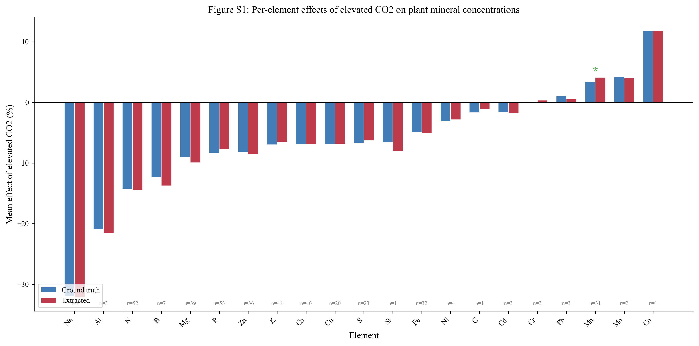
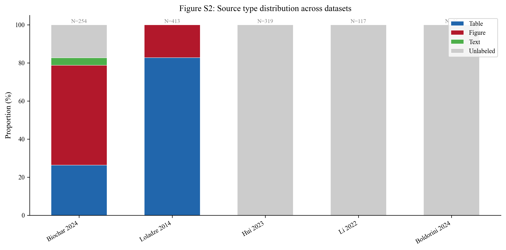
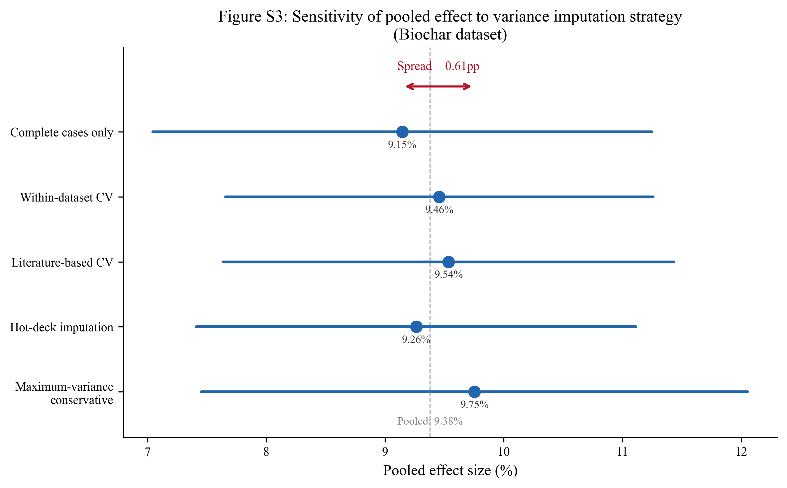

# Supplementary Materials

## Breaking the Extraction Bottleneck: A Single AI Agent Achieves Statistical Equivalence
## with Human-Extracted Meta-Analysis Data Across Five Agricultural Datasets

Generated: 2026-03-19

---

## Table S1: TOST Equivalence Results at Multiple Margins

Two one-sided tests (TOST) for equivalence applied at four margin levels
across all five validation datasets. Fixed margins test absolute agreement;
proportional margins test agreement relative to mean effect magnitude.

| Dataset | Margin Type | Margin (pp) | N | Mean Diff (pp) | TOST p | Result |
|---------|-------------|-------------|---|----------------|--------|--------|
| Loladze 2014 (mineral/CO2) | Fixed | 2.0 | 413 | 0.0111 | <0.0001 | Equivalent |
| Loladze 2014 (mineral/CO2) | Fixed | 3.0 | 413 | 0.0111 | <0.0001 | Equivalent |
| Loladze 2014 (mineral/CO2) | Proportional (20%) | 2.477 | 413 | 0.0111 | <0.0001 | Equivalent |
| Loladze 2014 (mineral/CO2) | Proportional (10%) | 1.2385 | 413 | 0.0111 | <0.0001 | Equivalent |
| Hui 2025 (Zn/wheat) | Fixed | 2.0 | 319 | 0.1171 | <0.0001 | Equivalent |
| Hui 2025 (Zn/wheat) | Fixed | 3.0 | 319 | 0.1171 | <0.0001 | Equivalent |
| Hui 2025 (Zn/wheat) | Proportional (20%) | 10.0464 | 319 | 0.1171 | <0.0001 | Equivalent |
| Hui 2025 (Zn/wheat) | Proportional (10%) | 5.0232 | 319 | 0.1171 | <0.0001 | Equivalent |
| Li 2022 (biostimulant/yield) | Fixed | 2.0 | 117 | -0.1472 | <0.0001 | Equivalent |
| Li 2022 (biostimulant/yield) | Fixed | 3.0 | 117 | -0.1472 | <0.0001 | Equivalent |
| Li 2022 (biostimulant/yield) | Proportional (20%) | 3.4097 | 117 | -0.1472 | <0.0001 | Equivalent |
| Li 2022 (biostimulant/yield) | Proportional (10%) | 1.7048 | 117 | -0.1472 | <0.0001 | Equivalent |
| Biochar 2024 (biochar/yield) | Fixed | 2.0 | 254 | -0.2184 | <0.0001 | Equivalent |
| Biochar 2024 (biochar/yield) | Fixed | 3.0 | 254 | -0.2184 | <0.0001 | Equivalent |
| Biochar 2024 (biochar/yield) | Proportional (20%) | 3.2181 | 254 | -0.2184 | <0.0001 | Equivalent |
| Biochar 2024 (biochar/yield) | Proportional (10%) | 1.6091 | 254 | -0.2184 | <0.0001 | Equivalent |
| Boldorini 2024 (predator/yield) | Fixed | 2.0 | 46 | 1.6089 | 0.4047 | Not equivalent |
| Boldorini 2024 (predator/yield) | Fixed | 3.0 | 46 | 1.6089 | 0.1965 | Not equivalent |
| Boldorini 2024 (predator/yield) | Proportional (20%) | 9.4155 | 46 | 1.6089 | <0.0001 | Equivalent |
| Boldorini 2024 (predator/yield) | Proportional (10%) | 4.7078 | 46 | 1.6089 | 0.0305 | Equivalent |

---

## Table S2: Per-Paper Agreement Statistics

Agreement metrics computed at the individual paper level. Tiers based on
paper-level MAE: Excellent (<5pp), Good (5--10pp), Fair (10--20pp), Poor (>20pp).

| Dataset | Paper ID | N obs | MAE (pp) | Direction (%) | Tier |
|---------|----------|-------|----------|---------------|------|
| Loladze 2014 | Barnes_1992 | 6 | 0.15 |  | Excellent |
| Loladze 2014 | Hogy_2009 | 12 | 1.46 |  | Excellent |
| Loladze 2014 | Huluka_1994 | 4 | 6.8 |  | Fair |
| Loladze 2014 | Wu_2004 | 4 | 0.0 |  | Excellent |
| Loladze 2014 | Keutgen_2001 | 5 | 0.67 |  | Excellent |
| Loladze 2014 | Lieffering_2004 | 13 | 4.15 |  | Good |
| Loladze 2014 | Pleijel_2009 | 3 | 0.0 |  | Excellent |
| Loladze 2014 | Fernando_2012a | 4 | 1.36 |  | Excellent |
| Loladze 2014 | 027_Peet_1986 | 5 | 3.19 |  | Good |
| Loladze 2014 | 031_Pal_2003 | 4 | 0.0 |  | Excellent |
| Loladze 2014 | 032_Kanowski_2001 | 19 | 2.41 |  | Good |
| Loladze 2014 | 034_Johnson_2003 | 22 | 0.27 |  | Excellent |
| Loladze 2014 | 035_Oksanen_2005 | 9 | 0.0 |  | Excellent |
| Loladze 2014 | 036_Schenk_1997 | 27 | 0.07 |  | Excellent |
| Loladze 2014 | 037_Haase_2008 | 1 | 3.07 |  | Good |
| Loladze 2014 | Al-Rawahy_2013 | 7 | 2.22 |  | Good |
| Loladze 2014 | Azam_2013 | 36 | 0.44 |  | Excellent |
| Loladze 2014 | Baslam_2012 | 10 | 2.35 |  | Good |
| Loladze 2014 | Baxter_1994 | 1 | 9.59 |  | Fair |
| Loladze 2014 | Blank_2011 | 1 | 2.05 |  | Good |
| Loladze 2014 | Campbell_2002 | 1 | 9.97 |  | Fair |
| Loladze 2014 | Fangmeier_2002 | 24 | 1.59 |  | Excellent |
| Loladze 2014 | Fernando_2012 | 8 | 0.32 |  | Excellent |
| Loladze 2014 | Finzi_2001 | 10 | 0.23 |  | Excellent |
| Loladze 2014 | Guo_2011 | 5 | 1.56 |  | Excellent |
| Loladze 2014 | Heagle_1993 | 7 | 3.03 |  | Good |
| Loladze 2014 | Housman_2012 | 7 | 0.64 |  | Excellent |
| Loladze 2014 | Khan_2013 | 18 | 0.53 |  | Excellent |
| Loladze 2014 | Luomala_2005 | 7 | 3.72 |  | Good |
| Loladze 2014 | Mjwara_1996 | 3 | 3.21 |  | Good |
| Loladze 2014 | Natali_2009 | 16 | 1.65 |  | Excellent |
| Loladze 2014 | Newbery_1995 | 2 | 3.0 |  | Good |
| Loladze 2014 | Niinemets_1999 | 9 | 0.53 |  | Excellent |
| Loladze 2014 | Niu_2013 | 2 | 1.25 |  | Excellent |
| Loladze 2014 | ONeill_1987 | 12 | 0.02 |  | Excellent |
| Loladze 2014 | Overdieck_1993 | 22 | 0.79 |  | Excellent |
| Loladze 2014 | Pfirrmann_1996 | 6 | 3.9 |  | Good |
| Loladze 2014 | Polley_2011 | 5 | 3.4 |  | Good |
| Loladze 2014 | Porter_1984 | 5 | 0.0 |  | Excellent |
| Loladze 2014 | Rodenkirchen_2009 | 13 | 4.01 |  | Good |
| Loladze 2014 | Seneweera_1997 | 10 | 1.18 |  | Excellent |
| Loladze 2014 | Singh_2013 | 10 | 0.17 |  | Excellent |
| Loladze 2014 | Wilsey_1994 | 13 | 0.03 |  | Excellent |
| Loladze 2014 | Woodin_1992 | 3 | 5.91 |  | Fair |
| Loladze 2014 | Ziska_1997 | 2 | 0.02 |  | Excellent |
| Hui 2025 | (aggregate - 319 obs) | 319 | 0.43 |  | Excellent |
| Li 2022 | 009_Ali_2019_Biostimulatory activities of Ascophyllum nodosum e | 1 | 0.54 | 100.0 | Excellent |
| Li 2022 | 027_Chen_2021_Effects of Seaweed Extracts on the Growt | 3 | 0.18 | 100.0 | Excellent |
| Li 2022 | 029_Ciepiela_2019_The effect of biostimulants derived from | 3 | 1.35 | 100.0 | Excellent |
| Li 2022 | 058_Fichhof_2018_Management of Biostimulant and Silicon i | 1 | 4.29 | 100.0 | Excellent |
| Li 2022 | 067_Grabowska_2012_The Effect of Cultivar and Biostimulant | 2 | 0.48 | 100.0 | Excellent |
| Li 2022 | 086_Knapowski_2019_Crop stimulants as a factor determining | 7 | 1.14 | 100.0 | Excellent |
| Li 2022 | 088_Kocira_2019_Effect of amino acid biostimulant on the | 8 | 1.18 | 100.0 | Excellent |
| Li 2022 | 090_Kocira_2020_Biochemical and economical effect of app | 4 | 0.65 | 100.0 | Excellent |
| Li 2022 | 091_Kocira_2018_Modeling biometric traits, yield and nut | 3 | 0.99 | 100.0 | Excellent |
| Li 2022 | 094_Kowalska_2021_Effect of Different Forms of Silicon on | 1 | 1.13 | 100.0 | Excellent |
| Li 2022 | 095_Kuisma_1989_The effect of foliar application of seaw | 2 | 1.43 | 100.0 | Excellent |
| Li 2022 | 1-s2.0-S0304423819306703-main | 6 | 0.01 | 100.0 | Excellent |
| Li 2022 | 1-s2.0-S0304423820302417-main | 10 | 1.37 | 90.0 | Excellent |
| Li 2022 | 1-s2.0-S1878818119307637-main | 12 | 0.0 | 100.0 | Excellent |
| Li 2022 | 1-s2.0-S1878818119309879-main | 1 | 3.22 | 100.0 | Excellent |
| Li 2022 | 105_Mattner_2018_Increased growth response of strawberry | 3 | 1.41 | 100.0 | Excellent |
| Li 2022 | 106_Matysiak_2018_Herbicides with natural and synthetic bi | 1 | 0.26 | 100.0 | Excellent |
| Li 2022 | 110_Michalak_2016_Evaluation of supercritical extracts of | 3 | 1.32 | 100.0 | Excellent |
| Li 2022 | 116_Nurdiawati_2019_Liquid feather protein hydrolysate as a | 1 | 0.45 | 100.0 | Excellent |
| Li 2022 | 120_Pohl_2019_The Eggplant Yield and Fruit Composition | 3 | 1.4 | 100.0 | Excellent |
| Li 2022 | 127_Radkowski_2018_Influence of foliar fertilization with a | 8 | 1.0 | 100.0 | Excellent |
| Li 2022 | 131_Rahman_2018_Chitosan biopolymer promotes yield and s | 6 | 1.02 | 100.0 | Excellent |
| Li 2022 | 1542-1558-15(3)2018 BR-18-165 | 2 | 2.15 | 100.0 | Excellent |
| Li 2022 | 158_Sulakhudin_2019_Application of Coastal Sediments and Fol | 4 | 0.37 | 100.0 | Excellent |
| Li 2022 | 175_Wilczewski_2018_Response of sugar beet to humic substanc | 2 | 3.3 | 100.0 | Excellent |
| Li 2022 | 604-615-14(3)2017BR-1503 | 1 | 1.47 | 100.0 | Excellent |
| Li 2022 | agriculture-10-00618-v2 | 4 | 2.34 | 100.0 | Excellent |
| Li 2022 | ali | 2 | 0.76 | 100.0 | Excellent |
| Li 2022 | article1400838000_Azarpour et al | 4 | 0.95 | 100.0 | Excellent |
| Li 2022 | plants-09-01633 | 8 | 0.83 | 100.0 | Excellent |
| Li 2022 | sustainability-11-02171 | 1 | 1.66 | 100.0 | Excellent |
| Biochar 2024 | 001_Adekiya_2019 | 4 | 0.08 |  | Excellent |
| Biochar 2024 | 007_Gathorne-Hardy_2009 | 1 | 2.0 |  | Excellent |
| Biochar 2024 | 016_Li_B_2016 | 6 | 1.56 |  | Excellent |
| Biochar 2024 | 021_Nobile_2022 | 12 | 1.22 |  | Excellent |
| Biochar 2024 | 041_Guerena_2013 | 12 | 0.89 |  | Excellent |
| Biochar 2024 | 063_Asai_2009 | 15 | 1.01 |  | Excellent |
| Biochar 2024 | 077_Zhang_J_2019 | 11 | 1.8 |  | Excellent |
| Biochar 2024 | 078_Wang_2012 | 14 | 1.35 |  | Excellent |
| Biochar 2024 | 081_Deenik_2010 | 8 | 1.63 |  | Excellent |
| Biochar 2024 | 082_Jose_2013 | 7 | 1.68 |  | Excellent |
| Biochar 2024 | 101_Liang_Feng_2014 | 9 | 0.32 |  | Excellent |
| Biochar 2024 | 116_Farrell_2014 | 12 | 1.98 |  | Excellent |
| Biochar 2024 | 130_Azeem_2019 | 8 | 0.48 |  | Excellent |
| Biochar 2024 | 133_Pandit_2018 | 14 | 2.02 |  | Good |
| Biochar 2024 | 145_Omara_2020 | 6 | 2.63 |  | Good |
| Biochar 2024 | 153_Wei_2022 | 4 | 2.11 |  | Good |
| Biochar 2024 | 166_Haefele_2011 | 20 | 0.98 |  | Excellent |
| Biochar 2024 | 184_Yeboah_2018 | 7 | 1.46 |  | Excellent |
| Biochar 2024 | 193_Islami_2011 | 9 | 0.67 |  | Excellent |
| Biochar 2024 | 207_Liu_2019 | 22 | 1.11 |  | Excellent |
| Biochar 2024 | 219_Xie_2021 | 12 | 0.18 |  | Excellent |
| Biochar 2024 | 223_Dong_2019 | 2 | 1.67 |  | Excellent |
| Biochar 2024 | 227_Niu_2017 | 9 | 1.37 |  | Excellent |
| Biochar 2024 | 229_Shi_2022 | 17 | 0.26 |  | Excellent |
| Biochar 2024 | 231_Zhang_2021 | 7 | 1.48 |  | Excellent |
| Biochar 2024 | 242_Liu_2014 | 6 | 2.33 |  | Good |
| Boldorini 2024 | Ali | 1 | 1.01 | 100.0 | Excellent |
| Boldorini 2024 | Bisseleua | 1 | 0.03 | 100.0 | Excellent |
| Boldorini 2024 | Borkhataria | 1 | 0.0 | 100.0 | Excellent |
| Boldorini 2024 | Classen | 1 | 0.16 | 100.0 | Excellent |
| Boldorini 2024 | Garfinkel | 3 | 0.06 | 100.0 | Excellent |
| Boldorini 2024 | Gras | 2 | 0.07 | 100.0 | Excellent |
| Boldorini 2024 | Hooks_et_al | 4 | 0.0 | 100.0 | Excellent |
| Boldorini 2024 | Ismoilov | 1 | 0.0 | 100.0 | Excellent |
| Boldorini 2024 | Lang | 9 | 0.0 | 100.0 | Excellent |
| Boldorini 2024 | Libran-Embid | 1 | 0.0 | 100.0 | Excellent |
| Boldorini 2024 | Maas | 2 | 48.16 | 0.0 | Poor |
| Boldorini 2024 | Martin | 1 | 0.04 | 100.0 | Excellent |
| Boldorini 2024 | Mols | 1 | 0.0 | 100.0 | Excellent |
| Boldorini 2024 | Saunders | 1 | 0.0 | 100.0 | Excellent |
| Boldorini 2024 | Snyder_Wise | 12 | 2.8 | 100.0 | Excellent |
| Boldorini 2024 | Suenaga_Hamamura | 4 | 1.35 | 100.0 | Excellent |
| Boldorini 2024 | Vichitbandha_Wise | 1 | 3.77 | 100.0 | Excellent |

**Tier summary** (N=120 papers):
- Excellent: 97 (80.8%)
- Good: 18 (15.0%)
- Fair: 4 (3.3%)
- Poor: 1 (0.8%)

---

## Table S3: Variance Recovery Summary

Variance information recovery across datasets. Direct variance refers to
SE/SD/CI extracted directly from papers. Indirect recovery includes
imputation from related statistics (CV, LSD, p-values).

| Dataset | N matched | Direct (%) | Indirect (+N) | Imputation spread (pp) | Notes |
|---------|-----------|------------|---------------|------------------------|-------|
| Biochar 2024 | 254 | 25.5 | 83 | 0.78 | Table data 5.5x more precise than figure data |
| Loladze 2014 | 413 | N/A | N/A | N/A | GT uses percentage change; variance not validated separately |
| Hui 2025 | 319 | N/A | N/A | N/A | Validated on effect sizes; variance not separately assessed |
| Li 2022 | 117 | N/A | N/A | N/A | Effect-size-only validation |
| Boldorini 2024 | 46 | N/A | N/A | N/A | lnRR-based validation |

---

## Table S4: Agent Replication (Run1 vs Run2)

Independent agent extraction runs on the same papers to assess reproducibility.
Aggregate pooled effects remained stable within 0.09--0.23 percentage points.

| Dataset | Matched obs | Papers | Run1 effect | Run2 effect | Diff (pp) | Notes |
|---------|-------------|--------|-------------|-------------|-----------|-------|
| Loladze 2014 | 665 | 41 | -4.95% | -5.04% | 0.09 | Run1 vs Run2 agent extraction |
| Hui 2025 | 362 | 24 | | | 6.31 | Large effect-size scale amplifies small proportional differences |
| Li 2022 | 204 | 30 | 10.16% | 10.39% | 0.23 | Aggregate effect stable across runs |

---

## Figure S1: Per-Element Effects of Elevated CO2

Mean effect of elevated CO2 on plant mineral concentrations, grouped by element.
Ground truth values from Loladze (2014) dataset compared with AI-extracted values.
Elements marked with * (Fe, Mn) show increases under elevated CO2, contrary to
the general pattern of mineral decline. Error in extraction is minimal across all
21 elements.

## Figure S2: Source Type Distribution

Distribution of data sources (table, figure, text) across the five validation
datasets. The Biochar dataset provides detailed source labeling, showing that
table-derived observations have 5.5x lower MAE than figure-estimated values.

## Figure S3: Variance Imputation Sensitivity

Sensitivity of the pooled biochar effect estimate to five variance imputation
strategies. The total spread across strategies is 0.78 percentage points,
indicating that the pooled effect is robust to the choice of imputation method.
Horizontal bars show 95% confidence intervals for each strategy.
